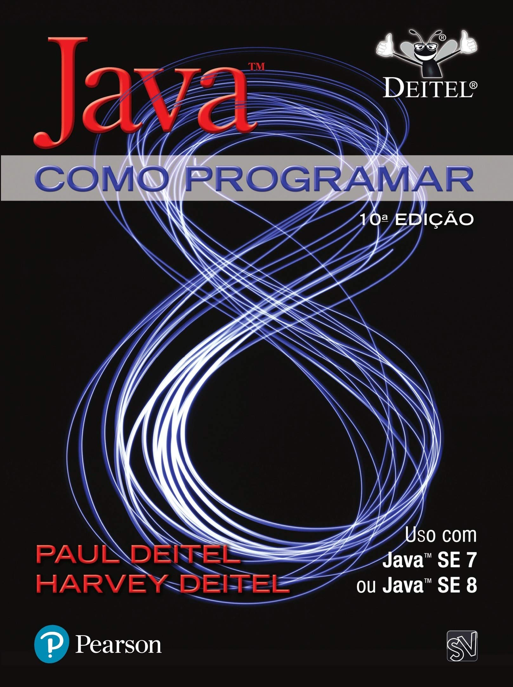
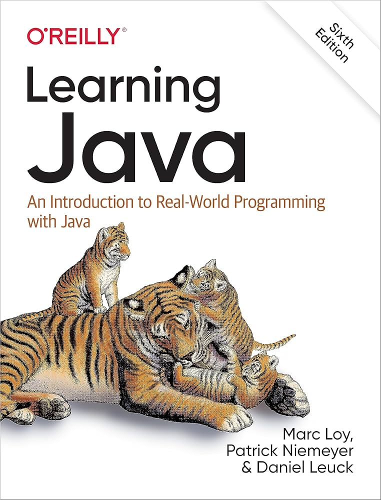
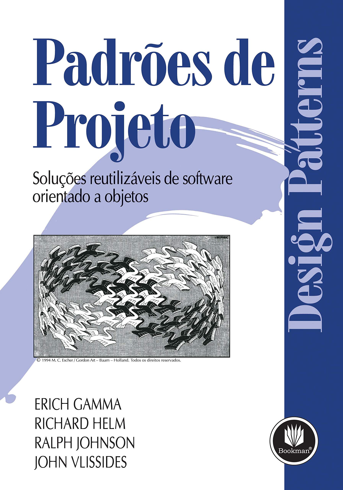
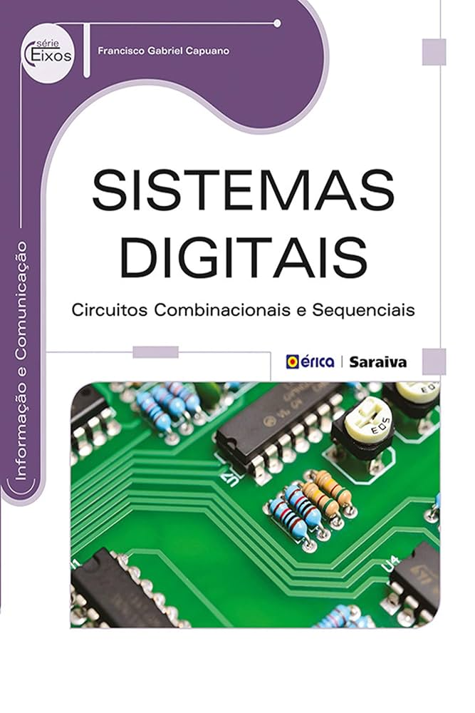
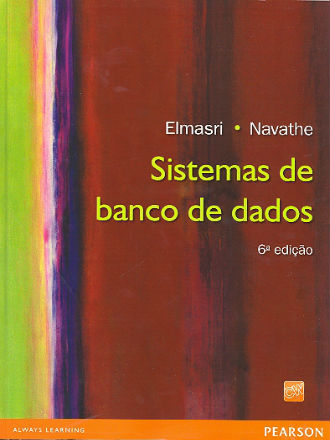

<!-- cabeçalho -->

<!--breve descrição-->

Engenheiro de Software

Graduando em Engenharia de Software pela PUC Minas, com foco no desenvolvimento de soluções que resolvem problemas reais e geram valor para clientes. Interesse em transformar necessidades do mundo real em sistemas eficientes, escaláveis e bem estruturados, aplicando boas práticas de engenharia e programação.

## 🖥 Tecnologias

<!--### Frameworks and Libraries:-->
<!-- linguagens e frameworks -->
<!--### Banco de Dados:-->
<!--### Plataforms, Tools and IDEs:-->

## ⏱ Minhas métricas
<!--github stats-->

<table>
<tr>
<td align="center" colspan="2">⌚<a href="https://wakatime.com/@joaquim_antonio">WakaTime</a></td>
</tr>
<tr>
<td>

</td>
<td>

</td>
</tr>
<tr>

</tr>
 <tr>
<td align="center" colspan="2">

</td>
 </tr>
</table>
<!-- pacman contibutionf

-->

<!-- interesses pessoais -->
## 🚀 Sobre Mim
- 💻Atuação em projetos full stack, com domínio em Java, JavaScript, C/C++ e frameworks como Spring Boot e React.js.
- 🔧 Experiência em desenvolvimento de APIs REST, integração com bancos de dados SQL e boas práticas de versionamento com Git.
- 💡 Interessado em projetos que trazem impacto real e resolvem problemas do cotidiano.
- 🌱  Em constante aprendizado e evolução, buscando aplicar soluções tecnológicas a problemas reais e complexos.

## ☎ Contato
<!--contatos-->

<table>
<tr>
 <td align="center" colspan="11"></td>
</tr>
<tr>
<td>
</td>
<td>
</td>
<td>
</td>
<td>
</td>
<td>
</td>
<td>
</td>
</tr>
<tr>
 <td align="center" colspan="11"></td>
</tr>
</table>

<!--livros -->
## 📖 Leituras recentes

<table>
<tr>
<td align="center" colspan="5"></td>
</tr>
<tr>
<td>

</td>
<td>

</td>
<td>

</td>
<td>

</td>
<td>

</td>
</tr>
<tr>
 <td align="center" colspan="5"></td>
</tr>
</table>

<table>
<tr>
 <td align="center" colspan="5"></td>
</tr>
<tr>
<td>

</td>
<td>

</td>
<td>

</td>
<td>

</td>
<td>

</td>
</tr>
<tr>
 <td align="center" colspan="5"></td>
</tr>
</table>

<!-- SPOTIFY 

Joaquim's Spotify Data

<table>
<tr>
 <td align="center" colspan="2"></td>
</tr>
<tr>
<td>

</td>
<td>

</td>
</tr>
<tr>
 <td align="center" colspan="2"></td>
</tr>
</table>

-->

<!--quotes

 <table>
  <tr>
   <td align="center" colspan="1"></td>
  </tr>
  <tr>
   <td>
   
   </td>
  </tr>
  <tr>
   <td align="center" colspan="1"></td>
  </tr> 
 </table>

-->
<!--footer-->

