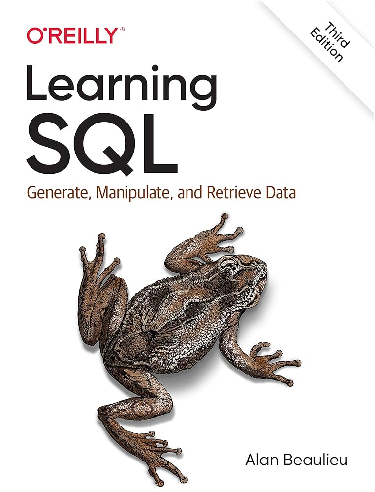

<!-- cabeçalho -->

&nbsp;&nbsp;&nbsp;

<!--breve descrição-->

<i><b>Olá</b> :wave:, sou o <code>Aramuni</code>, tenho 34 anos, moro em BH e sou programador desde os 15 anos de idade. Atualmente sou <code>professor</code> nos cursos de Engenharia de Software e Ciência da Computação da <a href="https://www.pucminas.br/" target="_blank">PUC Minas</a>.</i> :man_teacher:
&nbsp;&nbsp;&nbsp;

## ⏱ My metrics:
<!--github stats-->

<table>
<tr>
<td align="center" colspan="2">:watch: <a href="https://wakatime.com/@joaquim_antonio">WakaTime</a></td>
</tr>
<tr>
<td>

</td>
<td>

</td>
</tr>
<tr>
<td align="center" colspan="2"></td>
</tr>
</table>
<table>
<tr>
 <td align="center" colspan="1"></td>
</tr>
<tr>
<td>

</td>
</tr>
<tr>
<td align="center" colspan="1"></td>
</tr>
</table>
<!--interative contibution-->

## 🖥My skills: 
<!-- linguagens e frameworks -->
#### Languages:

  
  &nbsp;
  
  &nbsp;
  
  &nbsp;
  
  &nbsp;
  
  &nbsp;
  
  &nbsp;
  
  &nbsp;
      

#### Frameworks and Libraries:

  
  &nbsp;
  
  &nbsp;
  
   &nbsp;

<!--#### Banco de Dados:

  
  &nbsp;
  
  &nbsp;
  

-->

#### Tools and IDEs:

  
  &nbsp;
  
  &nbsp;
  
  &nbsp;
  
  &nbsp;
  
  &nbsp;
  
  &nbsp;
  
  &nbsp;

&nbsp;
&nbsp;

## ☎ Contact me: 
<!--contatos-->

<table>
<tr>
 <td align="center" colspan="11"></td>
</tr>
<tr>
<td>
</td>
<td>
</td>
<td>
</td>
<td>
</td>
<td>
</td>
<td>
</td>
</tr>
<tr>
 <td align="center" colspan="11"></td>
</tr>
</table>

<!-- interesses pessoais -->

Meus interesses pessoais:
<table>
<tr>
 <td align="center" colspan="2"></td>
</tr>
<tr>
<td>

</td>
<td width="500px" >

- :man_teacher: Na <a href="https://www.pucminas.br/" target="_blank">PUC Minas</a>, sou <code>professor</code> no curso de Engenharia de Software. Também sou <code>CTO</code> da Agência Experimental de Software do ICEI - Instituto de Ciências Exatas e Informática. 
- :mortar_board: Na <a href="https://newtonpaiva.br/" target="_blank">Newton Paiva</a>, fui <code>professor</code> nos cursos de Ciência da Computação, Sistemas de Informação e Análise e Desenvolvimento de Sistemas. 
- :airplane: Na <a href="https://in8.com.br/" target="_blank">IN8</a>, atuei como <code>Tech Manager</code>, responsável pela liderança de squads de devs de múltiplos projetos para o mercado de milhas aéreas. 
- :briefcase: Na <a href="https://www.betrybe.com/" target="_blank">Trybe</a>, atuei como <code>Tech Lead</code> de Currículo, Liderança de Instrução e Especialista em Instrução de Tecnologia. Ministrei aulas de Ciência da Computação para a primeira turma da escola. :man_teacher: 
- :man_teacher: Também fui <code>professor</code> de Arquitetura de Software na <a href="https://www.xpeducacao.com.br/" target="_blank">Faculdade XP Educação</a> e de Ciência da Computação na <a href="http://www.fumec.br/" target="_blank">Universidade FUMEC</a>. 
- :trophy: Fui o <a href="https://www.linkedin.com/posts/joaopauloaramuni_estou-muito-honrado-com-essa-homenagem-do-activity-7164606251341889536-_khY" target="_blank">professor destaque</a> do curso de Sistemas de Informação da <a href="https://newtonpaiva.br/" target="_blank">Newton Paiva</a> no segundo semestre de 2023. 
- :mortar_board: Fui o <a href="https://www.fumec.br/servicos/colacao-de-grau/homenagens/" target="_blank">patrono</a> da turma de Ciência da Computação da <a href="http://www.fumec.br/" target="_blank">Universidade FUMEC</a> no primeiro semestre de 2020. 
- :atom: Sou entusiasta da Linguagem C, veja alguns códigos que fiz <a href="https://github.com/joaopauloaramuni/c" target="_blank">aqui</a>. (Você já viu código recursivo em C em <a href="https://github.com/joaopauloaramuni/c/blob/main/PROJETOS/Aramuni.c" target="_blank">uma linha</a>? :thinking:) 
- :memo: Veja alguns artigos que publiquei <a href="https://scholar.google.com.br/citations?user=OARYxSYAAAAJ&hl=pt-BR&oi=ao" target="_blank">aqui</a>. 
- :books: Acesse os livros que já li ou estou lendo <a href="https://www.skoob.com.br/perfil/Aramuni" target="_blank">aqui</a>. 
- :soccer: Sou atleticano, torço para o <a href="https://www.arenamrv.com.br/" target="_blank">galão</a>. :rooster: 
- :basketball: Meus hobbies são <a href="https://muonline.webzen.com/pt" target="_blank">Mu online</a>, <a href="https://www.demolidores.com.br/" target="_blank">Tibia</a>, <a href="https://olympico.com.br/esportes/basquete/" target="_blank">basquete</a> e violão. 
- :tv: Minha série preferida chama-se <a href="https://www.imdb.com/title/tt0487831/" target="_blank">The IT Crowd</a>. Atualmente estou assistindo <a href="https://www.imdb.com/pt/title/tt0804484/" target="_blank">Foundation</a>, <a href="https://www.imdb.com/pt/title/tt10466872/" target="_blank">Dune: Prophecy</a>, <a href="https://www.imdb.com/title/tt14688458/" target="_blank">Silo</a>, <a href="https://www.imdb.com/title/tt9813792/" target="_blank">From</a> e <a href="https://www.imdb.com/title/tt15435876/" target="_blank">The Penguin</a>. 
- :speech_balloon: Pergunte-me sobre qualquer coisa, adoro ajudar pessoas. 
- :mailbox: Para me encontrar, este é meu <a href="mailto:joaopauloaramuni@gmail.com" target="_blank">e-mail</a> pessoal e este é meu <a href="mailto:joaoaramuni@pucminas.br" target="_blank">e-email</a> corporativo da PUC Minas. 
- :calendar: Essa é minha <a href="https://calendly.com/aramuni" target="_blank">agenda</a> se quiser marcar um horário para falarmos. 
- :page_facing_up: Veja meu <a href="http://lattes.cnpq.br/1208427665892059" target="_blank">Currículo Lattes</a> para mais informações.

</td>
<td>

</td>
</tr>
<tr>
 <td align="center" colspan="2"></td>
</tr>
</table>

<!--livros -->
## 📖 Recent readings:

<table>
<tr>
<td align="center" colspan="5"></td>
</tr>
<tr>
<td>

</td>
<td>

</td>
<td>

</td>
<td>

</td>
<td>

</td>
</tr>
<tr>
 <td align="center" colspan="5"></td>
</tr>
</table>

<table>
<tr>
 <td align="center" colspan="5"></td>
</tr>
<tr>
<td>

</td>
<td>

</td>
<td>

</td>
<td>

</td>
<td>

</td>
</tr>
<tr>
 <td align="center" colspan="5"></td>
</tr>
</table>

 

<!-- SPOTIFY -->
<!--api 1-->

Joaquim's Spotify Data

<table>
<tr>
 <td align="center" colspan="2"></td>
</tr>
<tr>
<td>

</td>
<td>

</td>
</tr>
<tr>
 <td align="center" colspan="2"></td>
</tr>
</table>

<!--quotes

 <table>
  <tr>
   <td align="center" colspan="1"></td>
  </tr>
  <tr>
   <td>
   
   </td>
  </tr>
  <tr>
   <td align="center" colspan="1"></td>
  </tr> 
 </table>

-->
<!--footer-->

